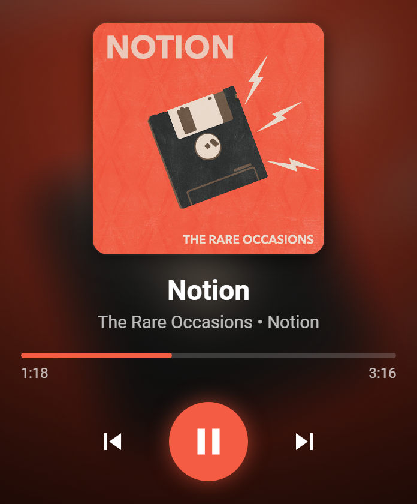

# YouTube Music — iCUE Widget

A **Now Playing** widget for Corsair iCUE LCDs (built and tested on the **Xeneon Edge**, vertical M / 696×840). It shows the current song, artist, album, album art, and playback progress, with **play/pause**, **next**, and **previous** controls.

It reads from the [YTMDesktop2]((https://github.com/Venipa/ytmdesktop2)) companion API server exposed by YouTube Music Desktop.

<p align="center">
  
</p>

## Features

- Song title, artist, and album
- Album art with a blurred full-screen backdrop
- Progress bar + elapsed / total time
- Play / pause, next, previous controls
- Accent color pulled live from each track's album art (toggleable)
- Fluid layout that adapts to the vertical Xeneon zones (S / M / L / XL) and to square/round LCDs
- Graceful "waiting for player" state when the server isn't reachable

## Requirements

- Corsair **iCUE** 5.45+ with an LCD device (dashboard / pump / keyboard LCD)
- **YouTube Music Desktop (YTMDesktop2)** with its companion **API server enabled**
- The API server reachable at `http://127.0.0.1:13091` (configurable in the widget settings)

## Install

1. Download the latest **`youtube-music.icuewidget`** from the [**Releases**](https://github.com/mrminus/icue-youtube-music-widget/releases/latest) page.
2. In iCUE, import the widget file and add it to your LCD.
3. Make sure YTMDesktop2's API server is running.

## Settings

Configurable from the widget's settings panel in iCUE:

| Setting | Default | Description |
| --- | --- | --- |
| Server URL | `http://127.0.0.1:13091` | Base URL of the YTMDesktop2 API server |
| Show Album Art | on | Show the album cover |
| Blurred Art Background | on | Use the album art as a blurred backdrop |
| Show Controls | on | Show the play/pause/next/prev buttons |
| Accent From Album Art | on | Tint the UI with each track's accent color |
| Accent / Text / Background Color | — | Manual color overrides |

> Note: The buttons require a touch-capable LCD (like the Xeneon Edge) or clicking within iCUE's dashboard editor. On non-touch LCDs the Now-Playing readout still works.

## API used

From the YTMDesktop2 companion server:

- `GET /track` — track metadata (title, author, album, thumbnail)
- `GET /track/state` — playback state (playing, progress, duration, accent, liked)
- `POST /track/toggle-play-state`, `POST /track/next`, `POST /track/prev` — controls

## Develop

Widget source lives at the repo root (`manifest.json`, `index.html`, `scripts/`, `styles/`, `resources/`).

Using the [iCUE Widget CLI](https://www.npmjs.com/package/icuewidget-cli):

```bash
npm install -g icuewidget-cli@latest
icuewidget validate .
icuewidget package .
```

`icuewidget package` produces the `.icuewidget` file for installation.

## License

MIT
